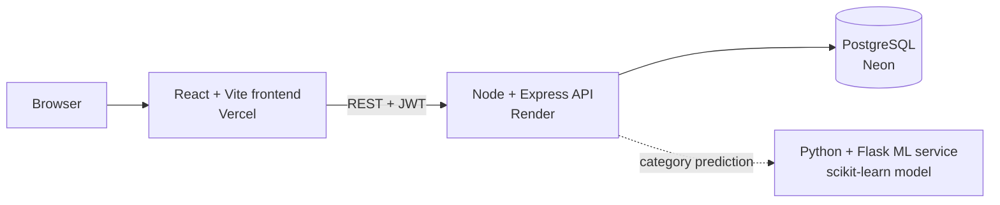

# SmartSpend

A full-stack personal finance tracker. Upload a bank statement or add expenses by hand, and SmartSpend categorizes every transaction, tracks budgets and savings goals, forecasts month-end spending, and warns you before you overspend.

**Live demo:** `<paste your Vercel link here>`
**Backend API:** https://smartspend-oydm.onrender.com/health

> The backend runs on a free hosting tier and sleeps when idle. The first request after a quiet period can take up to about 50 seconds.

## Screenshots

_Add 3 to 4 screenshots here: the dashboard with the pie chart, the budgets panel, and the CSV import result._

## Features

- **Accounts:** signup and login with JWT authentication and bcrypt password hashing
- **Expense tracking:** add transactions by hand, see spending by category in a pie chart
- **CSV statement import:** upload a bank statement and every row is inserted and categorized automatically
- **Auto-categorization:** a trained text classifier guesses the category from the transaction description, with keyword rules as a fallback
- **Budgets:** set a monthly limit per category and see live progress bars
- **Forecast:** projects month-end spending from the current daily pace
- **Savings goals:** set a target and deadline, and log savings toward it
- **Alerts:** warns at 90% of a budget, flags overspending, and detects likely recurring subscriptions

## Architecture



The ML service is a separate microservice. The API calls it for each imported transaction and falls back to keyword rules if the service is unreachable, so imports never fail because of it.

## Tech stack

| Layer | Technology |
|---|---|
| Frontend | React, Vite, Recharts |
| Backend | Node.js, Express, `pg`, `multer`, `csv-parse` |
| Database | PostgreSQL (Neon) |
| ML service | Python, Flask, scikit-learn, pandas, joblib |
| Auth | JWT, bcrypt |
| Hosting | Vercel (frontend), Render (backend), Neon (database) |

## How the categorizer works

1. Transaction descriptions are converted to TF-IDF features (unigrams and bigrams).
2. A Multinomial Naive Bayes classifier predicts one of six categories: Food, Travel, Rent, Subscriptions, Shopping, Other.
3. The model is trained on a small hand-labelled dataset (about 100 rows) in `ml-service/data/transactions_train.csv`.

**Honest limits:** on a held-out split of 21 rows the model scored about 71% accuracy. Some categories had only 2 to 4 test examples, so the numbers are noisy. Accuracy improves by adding more labelled rows and re-running `python train.py`. Real bank narrations are messier than this dataset, so treat the model as a working prototype, not a production classifier.

## API overview

All routes except signup and login require an `Authorization: Bearer <token>` header.

| Method | Route | Purpose |
|---|---|---|
| POST | `/api/auth/signup`, `/api/auth/login` | Create an account, get a token |
| GET, POST | `/api/transactions` | List or add transactions |
| GET | `/api/transactions/summary` | Totals by category |
| POST | `/api/upload/csv` | Import a CSV statement |
| GET, POST | `/api/budgets` | List budgets with spend, or set a budget |
| GET | `/api/budgets/forecast` | Month-end spending projection |
| GET, POST | `/api/goals` | List or create savings goals |
| POST | `/api/goals/:id/save` | Add savings toward a goal |
| GET | `/api/alerts` | Budget warnings and recurring charges |

**CSV format:** a header row with `date`, `amount` and `description` columns, for example:

```
date,amount,description
2026-09-01,450,Swiggy order dinner
2026-09-02,1200,Uber ride to airport
```

## Database

```sql
CREATE TABLE users (
    id SERIAL PRIMARY KEY,
    name VARCHAR(100) NOT NULL,
    email VARCHAR(150) UNIQUE NOT NULL,
    password_hash VARCHAR(255) NOT NULL,
    created_at TIMESTAMP DEFAULT NOW()
);

CREATE TABLE transactions (
    id SERIAL PRIMARY KEY,
    user_id INTEGER NOT NULL REFERENCES users(id) ON DELETE CASCADE,
    amount NUMERIC(12,2) NOT NULL,
    category VARCHAR(50) NOT NULL,
    description VARCHAR(255),
    txn_date DATE NOT NULL DEFAULT CURRENT_DATE,
    created_at TIMESTAMP DEFAULT NOW()
);

CREATE TABLE budgets (
    id SERIAL PRIMARY KEY,
    user_id INTEGER NOT NULL REFERENCES users(id) ON DELETE CASCADE,
    category VARCHAR(50) NOT NULL,
    monthly_limit NUMERIC(12,2) NOT NULL,
    UNIQUE(user_id, category)
);

CREATE TABLE goals (
    id SERIAL PRIMARY KEY,
    user_id INTEGER NOT NULL REFERENCES users(id) ON DELETE CASCADE,
    name VARCHAR(100) NOT NULL,
    target_amount NUMERIC(12,2) NOT NULL,
    saved_amount NUMERIC(12,2) NOT NULL DEFAULT 0,
    deadline DATE
);
```

## Run it locally

You need Node.js 20+, PostgreSQL (or a free Neon database), and Python 3.12 for the ML service.

**1. Database:** create a database and run the SQL above.

**2. Backend**

```
cd backend
copy .env.example .env     # then fill in DATABASE_URL and JWT_SECRET
npm install
npm run dev                # http://localhost:5000
```

**3. Frontend**

```
cd frontend
npm install
npm run dev                # http://localhost:5173
```

For local development, set `BASE` in `frontend/src/api.js` (and `Notifications.jsx`) to `"/api"`; the Vite dev server proxies it to the backend.

**4. ML service (optional)**

```
cd ml-service
py -3.12 -m pip install -r requirements.txt
py -3.12 train.py          # trains and saves category_model.joblib
py -3.12 app.py            # http://localhost:8000
```

Python 3.12 is recommended because scikit-learn and pandas do not always publish ready-made packages for the newest Python releases.

## Deployment notes

- **Database:** Neon (free serverless PostgreSQL)
- **Backend:** Render web service, root directory `backend`, build `npm install`, start `npm start`, environment variables `DATABASE_URL`, `JWT_SECRET`, `PORT`
- **Frontend:** Vercel, root directory `frontend`, with the API base URL pointing at the Render service

The ML service is not deployed yet. In production the API uses its keyword fallback rules for categorization.

## Known limitations and next steps

- Deploy the ML service as its own web service and point the API at it
- Let users correct a category and use those corrections as new training data
- Move the API base URL into an environment variable instead of editing source
- Send alerts by email instead of showing them only in the app
- Add automated tests and input validation on the API
- Parse PDF bank statements, not just CSV

## What I learned

_Add 3 to 4 sentences here in your own words: what was hardest, what you would change, and what you would build next._
